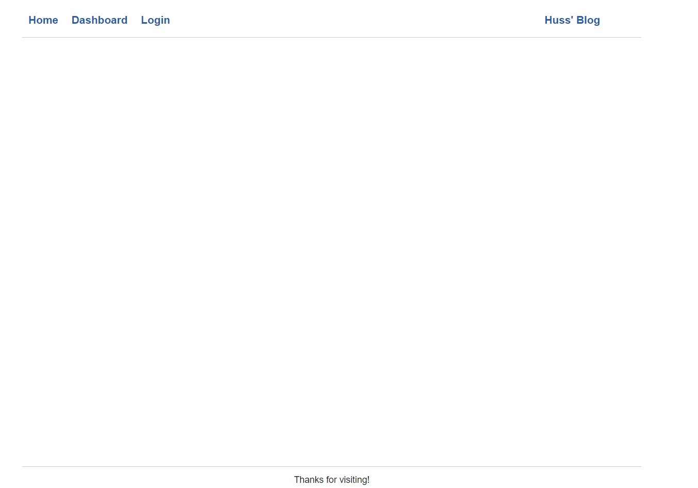
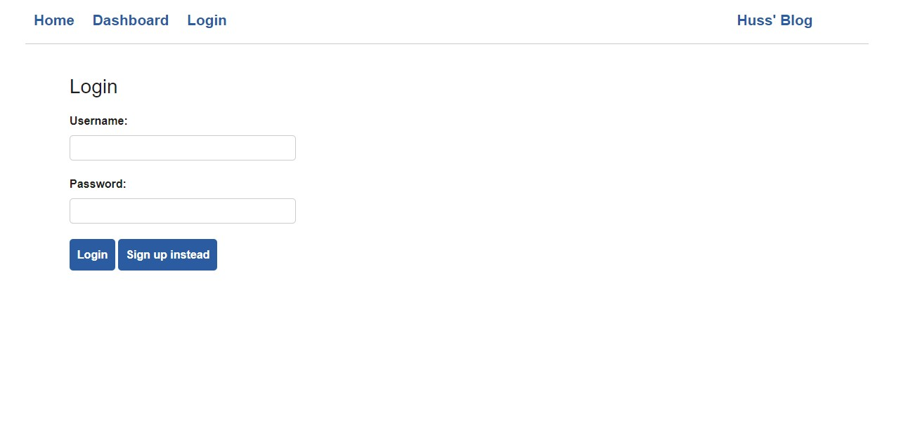
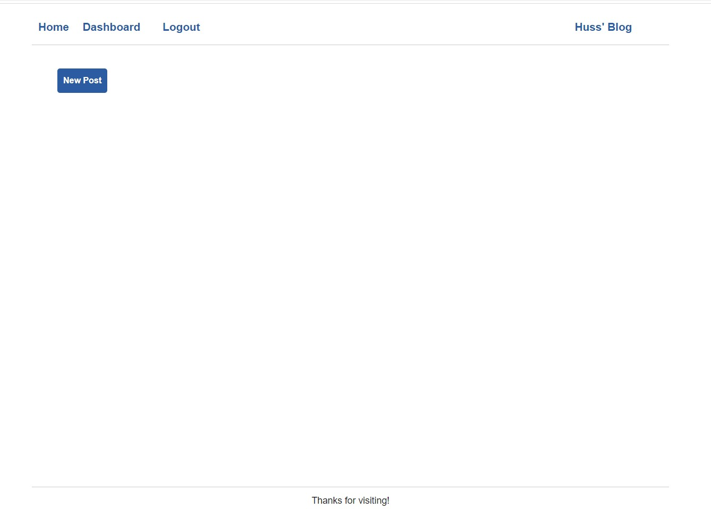
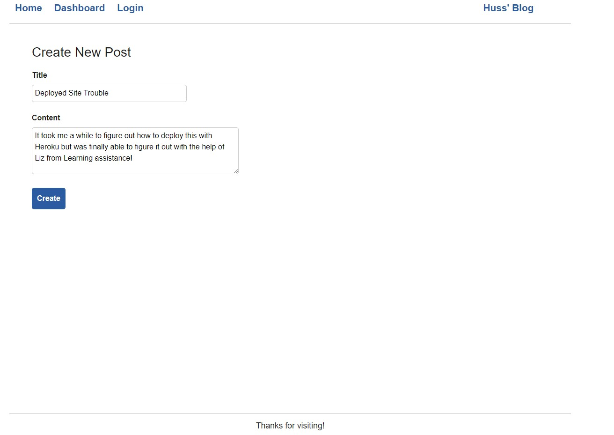
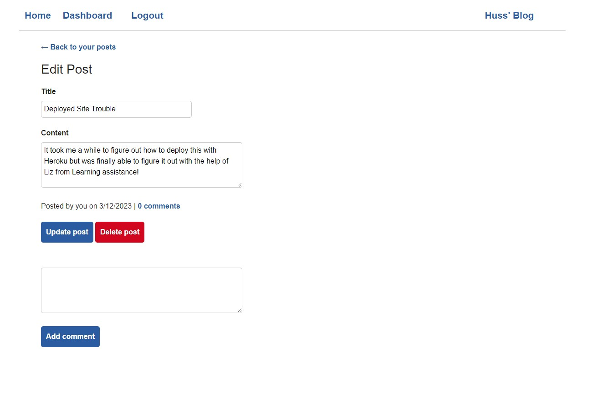
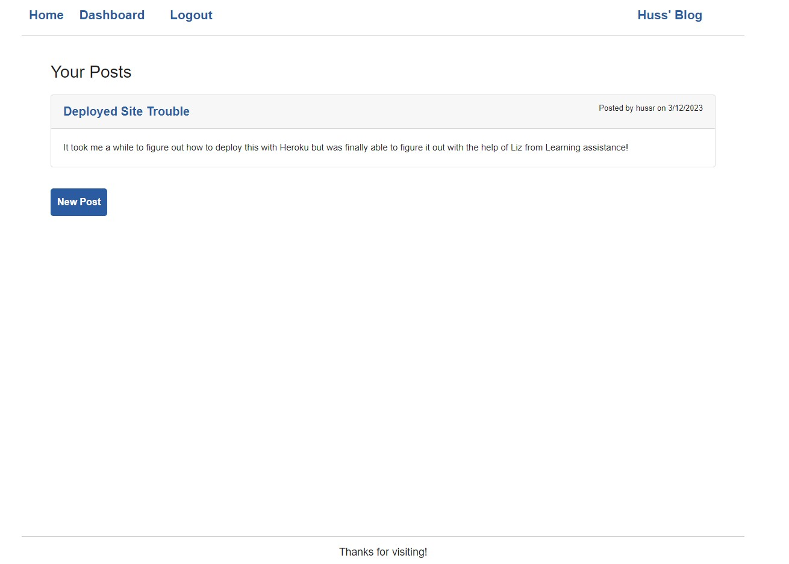

# Huss-Blog-Post

 ## Table of Contents: 
* [Description](#Description)
* [Actions Taken](#Actions)
* [Screen Shot](#Screen)
* [Links](#Links)

## Description
For this week we built a CMS-style blog site that allows developers the ability publish their blog posts and comment on other developers’ posts as well. The site was built completely from scratch and deploy through Heroku. Your app followed the MVC paradigm in its architectural structure, using Handlebars.js as the templating language, Sequelize as the ORM, and the express-session npm package for authentication.

## Actions Taken 
* Application’s folder structure follows the Model-View-Controller paradigm.
* Express-handlebars package to use Handlebars.js for your Views.
* Mysql2 and Sequelize packages were used to connect to a MySQL database for your Models, and create an Express.js API for your Controllers.
* Dotenv package used to use environment variables.
* Bcrypt package was used to hash passwords.
* Express-session and connect-session-sequelize packages were used to add authentication.

## Screen Shot
Home Page:

 

Login Page:

 

Signup Page:

 

New Post Page:

 

Create Post Page:

 

Edit and Delete

 

Posted Comment:

 

## Links

Heroku Link: https://still-stream-14407.herokuapp.com/

Github Link: https://github.com/hussrizk56/Huss-Blog-Post